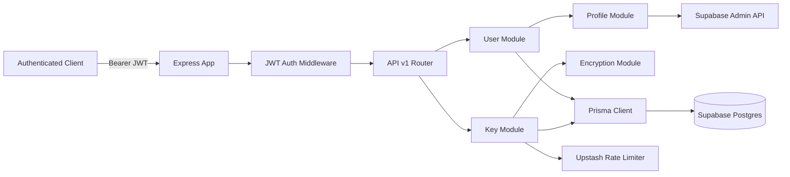

# Wombat Backend — Current State Documentation

_Last updated: 2026-05-01_

## Purpose

This documentation describes the backend that exists **now** in this repository after the modular v1 refactor. It is a factual baseline for future design, planning, and implementation work.

## Executive Summary

The current backend is a Node.js + TypeScript + Express service backed by Supabase Postgres via Prisma.

What is currently implemented:

- canonical JWT-protected endpoints under `/api/v1/user/...` and `/api/v1/key/...`
- module-centered backend structure for user, key, profile, and encryption domains
- lazy creation of a local `Profile` record from Supabase Auth user data
- storage of API keys encrypted at rest using per-user AES-256-GCM encryption
- Upstash-backed rate limiting on two read endpoints
- action logging for key fetch/add/update/delete
- automated route-contract and OpenAPI generation tests
- OpenAPI and Swagger UI documentation layer
- thin app boot layer plus separated controller/service/repository responsibilities

What is not implemented in this repository:

- Google KMS envelope encryption
- proxy API generation or request forwarding
- SDK wrapper/fork generation
- Go-based execution layer
- usage dashboards and analytics pipelines
- org/workspace authorization models
- outbound caching and proxy service adapters

## Documentation Index

1. [System Architecture](./system-architecture.md)
2. [API Reference](./api-reference.md)
3. [Data Model and Dependencies](./data-model-and-dependencies.md)
4. [Security Posture and Known Gaps](./security-posture-and-known-gaps.md)
5. [Codebase Structure and Discipline](./codebase-structure-and-discipline.md)

## Source Baseline

This doc set was derived from the current implementation under:

- `src/app/*`
- `src/api/v1/*`
- `src/modules/*`
- `src/middleware/*`
- `src/infrastructure/*`
- `src/shared/*`
- `src/types/*`
- `prisma/schema.prisma`
- `package.json`
- `tsconfig.json`
- `.env.example`

## Current System at a Glance

## Current-State Conclusions

- The repository currently implements an **early secure API-key storage backend** with a modular v1 API shell.
- The repository already supports authenticated, per-user ownership boundaries for stored keys.
- Encryption is still application-managed symmetric encryption, not KMS-backed envelope encryption.
- The broader Wombat proxy platform is not yet implemented.
