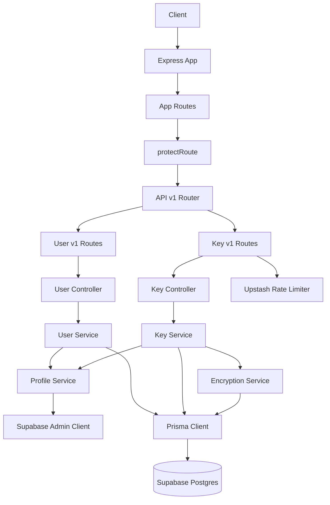

# System Architecture — Current State

## Overview

The backend currently implements two active domains:

1. user profile bootstrap and username management
2. encrypted API key storage and retrieval

It is a single Express service, but internally it now uses a layered modular structure:

- `app` for boot and global composition
- `api/v1` for versioned route grouping
- `modules` for domain logic
- `infrastructure` for external clients/config
- `middleware` for reusable Express concerns
- `shared` for cross-domain utilities and errors

## Current repository structure

```text
src/
  api/
    v1/
      index.ts
      user.routes.ts
      key.routes.ts
  app/
    app.ts
    routes.ts
    server.ts
  infrastructure/
    config/
    prisma/
    redis/
    supabase/
  middleware/
    auth.middleware.ts
    error.middleware.ts
    key-logs.middleware.ts
    rate-limit.middleware.ts
    validate-cursor.middleware.ts
  modules/
    encryption/
    key/
    profile/
    user/
  shared/
    errors/
    http/
    utils/
  types/
    express.d.ts
  generated/
    prisma/
prisma/
  schema.prisma
```

## Runtime topology



## Boot sequence

1. `src/server.ts` starts the app through `startServer()`.
2. `src/app/server.ts` builds the Express app and listens on `config.port`.
3. `src/app/app.ts` applies global middleware:
   - `cors()`
   - `express.json()`
   - top-level app routes
   - not-found handler
   - centralized error handler
4. `src/app/routes.ts` mounts the canonical versioned API surface under `/api/v1`.
5. `src/api/v1/index.ts` mounts the user and key route groups.

## Request flow

### Authentication boundary

All mounted application routes are protected under:

- `/api/v1` → `protectRoute`

`protectRoute`:

- reads the `Authorization` header
- extracts the bearer token
- verifies the token using Supabase JWKS and `ES256`
- writes `req.user = { sub }`
- rejects invalid or expired tokens with `401`

There is no server-side session store.

### User profile lifecycle

- the external auth identity is `req.user.sub`
- this maps to local `Profile.authId`
- if a profile is missing, the profile service fetches the Supabase user and creates a local `Profile`
- username is derived from `display_name`, `full_name`, or a generated fallback

### API key lifecycle

- request enters v1 route group
- route-level middleware applies rate limiting/logging as needed
- controller translates HTTP request/response only
- service performs business rules and ownership checks
- repository performs Prisma access only
- encryption service encrypts/decrypts the stored secret value

## Design intent of the current structure

This backend is still intentionally lightweight, but the structure now aims to keep responsibilities separate:

- top-level app composition should not contain business logic
- controllers should not contain Prisma queries
- services should own orchestration and rules
- repositories should own database access
- infrastructure should hide external client setup
- shared should stay small and generic, not absorb domain logic
